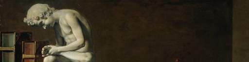
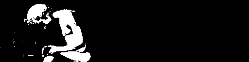
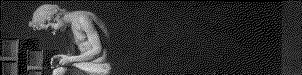
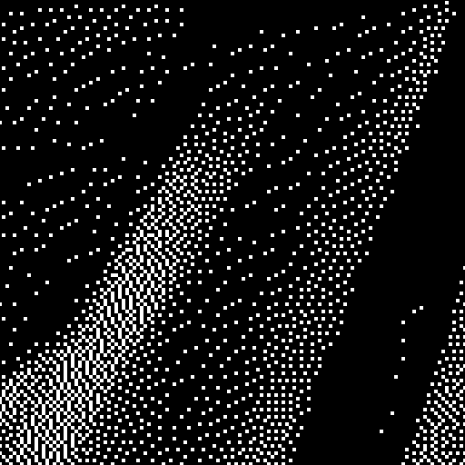
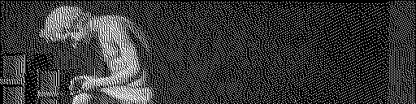
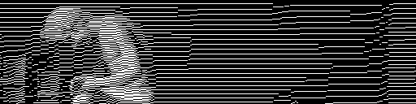
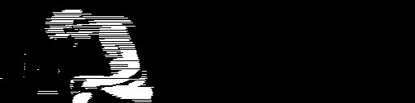
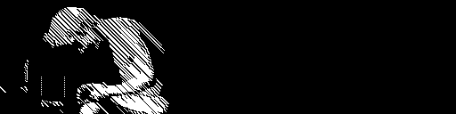
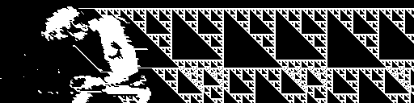
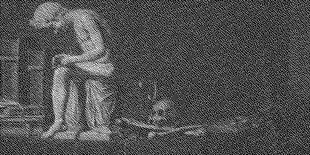

# dither-dream

Dither-dream is a tool for exploring variations on the Floyd-Steinberg dithering algorithm.

Try the [Dither-dream online demo](https://kgjenkins.github.io/dither-dream/)

---

# What is the Floyd-Steinberg algorithm?

The [Floyd-Steinberg dithering algorithm](https://en.wikipedia.org/wiki/Floyd%E2%80%93Steinberg_dithering) is a well-known method for reducing an image into a reduced set of colors while attempting to minimize perceptual changes.

Dithering is particulary useful when converting to a bitonal image that only has two colors (like black and white).  For example, consider this original full-color image:

If we convert it to a bitonal black and white based on a threshold luminosity of 50%, we get a result that loses much of the original detail:

But using Floyd-Steinberg dithering, we can preserve more information about the brightness of the original image.  It's not nearly as detailed as the original, but it does preserve the general brightness for different regions of the image.

# How does it work?

The Floyd-Steinberg algorithm is relatively simple.  It scans the image one pixel at a time, scanning the top line from left to right, then the next line, etc. until it reaches the bottom.  For a bitonal dither, we first need to convert the whole image to grayscale, so that each pixel is has a luminosity (perceived brightness) value of 0 to 255.

As the the algorithm examines each pixel, values 0-127 (<50%) become 0 (black) and values 128-255 (>50%) become 255 (white).  So a dark value of 16 would become black 0.  The "error" is calculated as the difference between the old and new values, which would be 16 in this case.  This error is then distributed across the neighboring pixels that have not yet been scanned, according to the following weights as specified by Floyd and Steinberg:

| x | x | x |
|:-:|:-:|:-:|
| **x** | @ | 7 |
| 3 | 5 | 1 |

As the scan progresses, in a region of dark (but not completely black) pixels, this error will eventually accumulate enough to have an occasional white pixel.  Part of the beauty of the result is the way that these occasional points are spaced out, sometimes appearing to be random and sometimes with a discernable pattern.

# Variations

I was curious why or how the weighting matrix above was calculated.  Floyd-Steinberg is very fast to compute because it only needs to scan once through each pixel.  That is why the error is not distributed to any of the pixels above or to the left in the current row.  But why the 7, 3, 5, 1 values?  I haven't seen any explanation of why these specific values were chosen, besides the fact that they add up to 16 (so actually we are adding 7/16 of the error to the pixel to the right).

| x | x | x |
|:-:|:-:|:-:|
| **x** | @ | 7/16 |
| 3/16 | 5/16 | 1/16 |

I wanted to experiment with other variations of weights.  Maybe other values would result in unpleasant or rigid patterns of dots, and 7,3,5,1 was the only way to have a balanced output?  Well, let's try some variations...

Here are several ways to split up the 1/16s across the four available directions:

 7, 3, 5, 1 (Floyd-Steinberg)

 4, 4, 4, 4 (equal distribution)

 8, 0, 8, 0 (right and down only)

 0, 8, 0, 8 (diagonals only)

 8, 8, 0, 0 (right and down-left only)

What if we use some negative numbers?  If we use a negative weight for the rightward direction, we'll end up with some long horizontal lines, but since the the total is still 16, the result still gives a pretty good sense of the general brightness of different regions in the image.

 -4, 4, 12, 4

Now, what if we eliminate the constraint that the total should be 16?  If the total is less than 16, the result will be somewhere between a dither and a naive bitonal (0, 0, 0, 0) image.

 -8, 0, 4, 0

 0, 8, 0, -8

If we use even larger negative values, and increase the contrast of the original image, things really start to get interesting.  Here the results begin to resemble phenomena like the [Sierpinski triangle](https://en.wikipedia.org/wiki/Sierpi%C5%84ski_triangle) and other types of [elementary cellular automata](https://en.wikipedia.org/wiki/Elementary_cellular_automaton#Random_initial_state)

 -17, 0, 0, -17

# Let me try!

See the [Dither-dream online demo](https://kgjenkins.github.io/dither-dream/) to play with parameters and see the results for yourself!
